<div align="center">

<!-- Animated Header Wave Banner -->


<!-- Dynamic Animated Typing Subtitle -->
<a href="https://github.com/parthkale3231/MLOps">
  
</a>

<p align="center">
  <b>A battle-tested, production-ready Machine Learning system engineered for real-time customer churn prediction, automated lifecycle governance, experiment tracking, and zero-downtime cloud continuous deployment.</b>
</p>

<!-- Tech Stack Badges -->
<p align="center">
  
  
  
  
  
  
  
  
  
  
</p>

<!-- Quick Navigation Pill Buttons -->
<p align="center">
  <a href="#-system-architecture"><b>Architecture</b></a> •
  <a href="#-key-features"><b>Key Features</b></a> •
  <a href="#-mlflow-experiment-tracking--benchmarks"><b>MLflow Benchmarks</b></a> •
  <a href="#-rest-api-reference--live-testing"><b>REST API</b></a> •
  <a href="#-cicd-pipeline-deep-dive"><b>CI/CD Pipeline</b></a> •
  <a href="#-getting-started"><b>Quick Start</b></a> •
  <a href="#-project-structure"><b>Structure</b></a>
</p>

---

</div>

## 📌 Executive Summary

Customer attrition is one of the most critical metrics in modern SaaS, subscription, and telecommunications businesses. This repository delivers an **enterprise-grade, production-hardened MLOps solution** that automates the entire machine learning lifecycle:

* 🎯 **Accurate Churn Scoring**: Ensemble Random Forest with calibrated probability outputs and customer risk-tier classification (`LOW`, `MEDIUM`, `HIGH`).
* 🔄 **Reproducible Data & Models**: Data version control with **DVC** and full experiment traceability with **MLflow** (metrics, parameters, confusion matrices, and model registry).
* 🛡️ **Automated Quality Gates**: Minimum F1-score threshold (`MIN_F1 = 0.55`) and automated unit test suite gating every build.
* 🚀 **Zero-Downtime Deployment**: 8-stage **Jenkins CI/CD pipeline** that packages the application into optimized Docker containers, publishes to **AWS ECR**, and executes seamless rolling deployment to **AWS EC2**.

---

## 🏗️ System Architecture

```mermaid
flowchart TD
    classDef data fill:#1e293b,stroke:#38bdf8,stroke-width:2px,color:#f8fafc;
    classDef ml fill:#0f172a,stroke:#818cf8,stroke-width:2px,color:#f8fafc;
    classDef cicd fill:#1e1e38,stroke:#fbbf24,stroke-width:2px,color:#f8fafc;
    classDef cloud fill:#0d233a,stroke:#34d399,stroke-width:2px,color:#f8fafc;
    classDef serve fill:#261438,stroke:#f472b6,stroke-width:2px,color:#f8fafc;

    subgraph Data_Layer ["📦 1. Data Governance & Versioning"]
        D1["Raw Telco Dataset (customer_churn.csv)"]:::data --> D2["DVC Tracking & Remote Storage"]:::data
        D2 --> D3["Preprocessing & ColumnTransformer"]:::data
    end

    subgraph ML_Layer ["🧠 2. ML Lifecycle & Experimentation"]
        D3 --> M1["5x Hyperparameter Tuning Runs"]:::ml
        M1 --> M2["MLflow Tracking Server (SQLite Backend)"]:::ml
        M2 --> M3["Artifact Logging (Metrics, ConfMatrix, Params)"]:::ml
        M3 --> M4["Model Registry: 'customer-churn-model'"]:::ml
        M4 --> M5["Best Model Export (models/churn_model.joblib)"]:::ml
    end

    subgraph CICD_Layer ["⚙️ 3. Jenkins CI/CD Quality Pipeline"]
        M5 --> J1["Stage 1-3: Checkout & DVC Pull"]:::cicd
        J1 --> J2["Stage 4: Automated Training Workflow"]:::cicd
        J2 --> J3["Stage 5: Quality Gate (MIN_F1 >= 0.55)"]:::cicd
        J3 --> J4["Stage 6: Pytest Suite Execution"]:::cicd
        J4 --> J5["Stage 7: Docker Image Build & Tagging"]:::cicd
    end

    subgraph Cloud_Layer ["☁️ 4. Container Registry & Cloud Hosting"]
        J5 --> C1["AWS ECR Login & Push (customer-churn-api)"]:::cloud
        C1 --> C2["SSH Agent Remote Automation"]:::cloud
        C2 --> C3["AWS EC2 Host (Ubuntu Server)"]:::cloud
        C3 --> C4["Rolling Container Swap (Port 8000:8000)"]:::cloud
    end

    subgraph Serving_Layer ["⚡ 5. High-Throughput Serving & Clients"]
        C4 --> S1["FastAPI Microservice (Uvicorn ASGI)"]:::serve
        S1 --> S2["Endpoints: /health, /predict, /predict/batch"]:::serve
        S2 --> S3["Swagger UI & Real-Time Client Inference"]:::serve
    end
```



---

## ✨ Key Features

<table>
  <tr>
    <td width="50%">
      <h3>🎯 Production ML Pipeline</h3>
      <ul>
        <li><b>Scikit-Learn Pipeline:</b> Encapsulates <code>StandardScaler</code> for numerical attributes and <code>OneHotEncoder</code> for categorical attributes into a unified pipeline artifact.</li>
        <li><b>Zero Data Leakage:</b> Preprocessing parameters fit strictly on the training partition.</li>
        <li><b>Risk Stratification:</b> Computes churn probability and automatically assigns risk tiers (<code>LOW &lt; 0.40</code>, <code>MEDIUM 0.40–0.70</code>, <code>HIGH &ge; 0.70</code>).</li>
      </ul>
    </td>
    <td width="50%">
      <h3>📊 Systematic Experiment Tracking</h3>
      <ul>
        <li><b>MLflow Integration:</b> Tracks parameters (<code>n_estimators</code>, <code>max_depth</code>, <code>test_size</code>), metrics (<code>accuracy</code>, <code>precision</code>, <code>recall</code>, <code>f1</code>), and confusion matrix plots.</li>
        <li><b>Centralized Registry:</b> Best performing model registered directly to <code>customer-churn-model</code> in MLflow.</li>
        <li><b>Audit-Ready Logs:</b> All training execution and parameter impacts preserved in <code>logs/training.log</code>.</li>
      </ul>
    </td>
  </tr>
  <tr>
    <td width="50%">
      <h3>⚡ Resilient FastAPI Service</h3>
      <ul>
        <li><b>Real-Time Inference:</b> Single-record (<code>/predict</code>) and bulk (<code>/predict/batch</code>) scoring with sub-millisecond response latency.</li>
        <li><b>Pydantic V2 Schemas:</b> Strict input validation and field constraints with informative HTTP error reporting.</li>
        <li><b>Health & Diagnostics:</b> <code>/health</code> probe reporting model status, memory loading, and runtime configuration.</li>
      </ul>
    </td>
    <td width="50%">
      <h3>🚀 Continuous Delivery with AWS & Jenkins</h3>
      <ul>
        <li><b>Declarative Jenkins Pipeline:</b> End-to-end automation from code commit to cloud deployment.</li>
        <li><b>Automated Quality Gates:</b> Enforces unit test passing and metric thresholds before allowing image builds.</li>
        <li><b>Immutable Containers:</b> Docker images tagged with <code>${BUILD_NUMBER}</code> and <code>latest</code> pushed to <b>AWS ECR</b> and deployed to <b>AWS EC2</b>.</li>
      </ul>
    </td>
  </tr>
</table>

---

## 📊 MLflow Experiment Tracking & Benchmarks

The training pipeline executes an automated 5-run hyperparameter grid across tree ensemble depth and estimator volume, recording all metrics to SQLite:

| Run Name | `n_estimators` | `max_depth` | Accuracy | Precision | Recall | F1 Score | Status |
| :--- | :---: | :---: | :---: | :---: | :---: | :---: | :---: |
| `Run_1_RF_100_depth_5` | 100 | 5 | 79.35% | 65.90% | 45.99% | 0.5417 | Candidate |
| `Run_2_RF_100_depth_10` | 100 | 10 | 79.49% | 63.41% | 53.74% | 0.5818 | Candidate |
| `Run_3_RF_200_depth_5` | 200 | 5 | 79.21% | 65.64% | 45.45% | 0.5371 | Candidate |
| `Run_4_RF_200_depth_10` | 200 | 10 | 79.28% | 62.65% | 54.28% | 0.5817 | Candidate |
| **`Run_5_RF_300_depth_10`** | **300** | **10** | **79.42%** | **62.88%** | **54.81%** | **0.5857** | 🏆 **Registered Best** |

### 🔍 Key Parameter Insights
* **Depth Scaling (`max_depth: 5 ➔ 10`)**: Constrained trees (`depth=5`) optimize precision (~66%) but miss at-risk churners (recall ~46%). Increasing to `depth=10` boosts churn recall by **+8.8%** and F1 to **0.5857**.
* **Ensemble Size (`n_estimators: 100 ➔ 300`)**: Increasing trees stabilizes the variance across customer demographic subgroups with minimal inference latency overhead.

```text
Best Model Performance Summary:
┌───────────────────┬──────────────┬──────────────────────────────────────────┐
│ Metric            │ Score        │ Progress Visual                          │
├───────────────────┼──────────────┼──────────────────────────────────────────┤
│ Accuracy          │ 79.42%       │ [████████████████████████░░░░░░] 79.4%   │
│ Precision         │ 62.88%       │ [███████████████████░░░░░░░░░░░] 62.9%   │
│ Recall            │ 54.81%       │ [████████████████░░░░░░░░░░░░░░] 54.8%   │
│ F1 Score          │ 0.5857       │ [█████████████████░░░░░░░░░░░░░] 58.6%   │
└───────────────────┴──────────────┴──────────────────────────────────────────┘
```

---

## ⚡ REST API Reference & Live Testing

The service exposes production-ready endpoints with automatic OpenAPI documentation.

### 🌐 Endpoints

| Method | Endpoint | Description | Auth |
| :--- | :--- | :--- | :---: |
| `GET` | `/` | API status, title, version, and documentation index | None |
| `GET` | `/health` | Liveness and model loading readiness probe | None |
| `POST` | `/predict` | Real-time single customer churn risk prediction | None |
| `POST` | `/predict/batch` | High-throughput batch customer scoring | None |
| `GET` | `/docs` | Interactive Swagger UI API documentation | Browser |
| `GET` | `/redoc` | ReDoc API specifications | Browser |

---

### 🧪 Sample Request: Single Prediction (`POST /predict`)

```bash
curl -X POST "http://3.7.109.246:8000/predict" \
     -H "Content-Type: application/json" \
     -d '{
       "tenure": 2,
       "MonthlyCharges": 89.85,
       "TotalCharges": 179.70,
       "Contract": "Month-to-month",
       "InternetService": "Fiber optic",
       "PaymentMethod": "Electronic check",
       "OnlineSecurity": "No",
       "TechSupport": "No",
       "PaperlessBilling": "Yes"
     }'
```

#### 📦 Response (`200 OK`)
```json
{
  "churn_prediction": 1,
  "churn_probability": 0.814,
  "risk_level": "HIGH",
  "explanation": "High churn risk detected (81.4%). Immediate customer retention intervention recommended."
}
```

<details>
<summary><b>👉 View Batch Prediction Request (<code>POST /predict/batch</code>)</b></summary>

```bash
curl -X POST "http://3.7.109.246:8000/predict/batch" \
     -H "Content-Type: application/json" \
     -d '[
       {
         "tenure": 65,
         "MonthlyCharges": 20.05,
         "TotalCharges": 1300.50,
         "Contract": "Two year",
         "InternetService": "No",
         "PaymentMethod": "Mailed check",
         "OnlineSecurity": "No internet service",
         "TechSupport": "No internet service",
         "PaperlessBilling": "No"
       },
       {
         "tenure": 4,
         "MonthlyCharges": 95.20,
         "TotalCharges": 380.80,
         "Contract": "Month-to-month",
         "InternetService": "Fiber optic",
         "PaymentMethod": "Electronic check",
         "OnlineSecurity": "No",
         "TechSupport": "No",
         "PaperlessBilling": "Yes"
       }
     ]'
```

**Response (`200 OK`)**:
```json
{
  "total_records": 2,
  "predictions": [
    {
      "customer_index": 0,
      "churn_prediction": 0,
      "churn_probability": 0.043,
      "risk_level": "LOW"
    },
    {
      "customer_index": 1,
      "churn_prediction": 1,
      "churn_probability": 0.832,
      "risk_level": "HIGH"
    }
  ]
}
```
</details>

---

## 🔄 CI/CD Pipeline Deep Dive

The project features a **Jenkins Declarative Pipeline** executing across 8 sequential, fault-tolerant stages:

```
[ Git Checkout ] 
       │
       ▼
[ Install Dependencies ] ➔ python -m venv, pip install -r requirements.txt
       │
       ▼
[ DVC Pull Data ] ───────➔ dvc pull from local/remote storage, confirm dataset
       │
       ▼
[ Train Model ] ─────────➔ 5 MLflow experiments, metrics, artifacts, model registry
       │
       ▼
[ Evaluate Quality Gate ]➔ Quality check (MIN_F1 >= 0.55), aborts build on regression
       │
       ▼
[ Automated Pytest ] ────➔ pytest -q (data loading, preprocessing, null checks)
       │
       ▼
[ Build Docker Image ] ──➔ Build Dockerfile.api with :${BUILD_NUMBER} and :latest
       │
       ▼
[ Push to AWS ECR ] ─────➔ aws ecr get-login-password, docker push to AWS ECR
       │
       ▼
[ Deploy to AWS EC2 ] ───➔ SSH to EC2, docker pull, graceful stop, swap container :8000
```

<details>
<summary><b>👉 View Jenkins Environment & AWS Cloud Config</b></summary>

```groovy
environment {
    AWS_REGION          = 'ap-south-1'
    AWS_ACCOUNT_ID      = '521024928341'
    ECR_REPOSITORY      = 'customer-churn-api'
    IMAGE_TAG           = "${BUILD_NUMBER}"
    EC2_PUBLIC_IP       = '3.7.109.246'
    AWS_SHARED_CREDENTIALS_FILE = 'C:\\Users\\Parth\\.aws\\credentials'
    AWS_CONFIG_FILE             = 'C:\\Users\\Parth\\.aws\\config'
}
```
</details>

---

## 🚀 Getting Started

### 1. Prerequisites
- **Python 3.10+** (Tested on Python 3.12)
- **Git** & **Git Bash**
- **Docker Desktop** (Optional, for containerized run)
- **AWS CLI** (Configured if deploying to AWS)

---

### 2. Installation & Setup

```bash
# Clone the repository
git clone https://github.com/parthkale3231/MLOps.git
cd customer-churn-ml

# Create and activate virtual environment
# Windows (PowerShell):
python -m venv .venv
.\.venv\Scripts\Activate.ps1

# Linux/macOS:
python3 -m venv .venv
source .venv/bin/activate

# Upgrade pip and install dependencies
pip install --upgrade pip
pip install -r requirements.txt
```

---

### 3. Data Sync with DVC

```bash
# Pull dataset using DVC
dvc pull

# Verify dataset presence
python -c "from src.config import DATA_PATH; assert DATA_PATH.exists(); print('Dataset confirmed:', DATA_PATH)"
```

---

### 4. Training & MLflow Tracking

Execute the multi-run training pipeline:
```bash
python -m src.train
```

Launch the interactive MLflow UI to inspect runs, parameters, confusion matrices, and registered models:
```bash
mlflow ui --backend-store-uri sqlite:///mlflow.db --port 5000
```
> Open your browser at [http://localhost:5000](http://localhost:5000)

---

### 5. Evaluate Model & Run Quality Gate

```bash
# Run quality gate with standard threshold (MIN_F1=0.55)
python -m src.evaluate
```

---

### 6. Run Automated Tests

```bash
pytest -v
```

---

### 7. Run FastAPI Service Locally

```bash
# Start Uvicorn development server
uvicorn src.api:app --host 0.0.0.0 --port 8000 --reload
```
> Access interactive Swagger UI docs at [http://localhost:8000/docs](http://localhost:8000/docs)

---

### 8. Run with Docker

```bash
# Build the Docker image
docker build -f Dockerfile.api -t customer-churn-api:latest .

# Run the container
docker run -d --name churn-service -p 8000:8000 customer-churn-api:latest

# Verify health endpoint
curl http://localhost:8000/health
```

---

## 📂 Project Structure

```text
customer-churn-ml/
│
├── .dvc/                             # DVC internal configuration & storage pointers
├── .github/                          # GitHub workflow templates & automations
├── data/
│   ├── customer_churn.csv            # Telco customer dataset (tracked via DVC)
│   └── customer_churn.csv.dvc        # DVC pointer metadata file
│
├── models/
│   └── churn_model.joblib            # Production-ready serialized pipeline artifact
│
├── notebooks/
│   └── exploration.ipynb             # Exploratory Data Analysis & visual analytics
│
├── src/
│   ├── __init__.py                   # Module package initializer
│   ├── config.py                     # Centralized paths, hyperparameters & settings
│   ├── data_preprocessing.py         # Cleaning, null imputation & ColumnTransformer
│   ├── train.py                      # 5-run MLflow training, metric logging & registry
│   ├── evaluate.py                   # Automated quality gate evaluation (MIN_F1)
│   ├── predict.py                    # CLI inference & probability scoring utility
│   └── api.py                        # High-throughput FastAPI REST application
│
├── tests/
│   ├── __init__.py                   # Test suite package initializer
│   └── test_preprocessing.py         # Unit tests for loading, cleaning & schemas
│
├── logs/
│   └── training.log                  # Persistent training logs and metric histories
│
├── mlartifacts/                      # MLflow experiment artifacts (confusion matrices, models)
├── mlflow.db                         # SQLite backend store for MLflow tracking
├── Dockerfile                        # General runtime container definition
├── Dockerfile.api                    # Optimized production FastAPI container image
├── Jenkinsfile                       # 8-stage automated CI/CD pipeline definition
├── requirements.txt                  # Locked Python dependency manifest
└── README.md                         # Project documentation
```

---

## 🛡️ Testing & Quality Assurance

Automated unit tests ensure data integrity and prevent regressions across builds:

```bash
# Run pytest with detailed verbose output
pytest -v --tb=short
```

**Covered Test Scenarios:**
- ✅ **Data Ingestion**: Verifies CSV integrity and required schema columns.
- ✅ **Missing Value Handling**: Verifies numerical conversion and whitespace replacement in `TotalCharges`.
- ✅ **Binary Target Encoding**: Asserts `Churn` column is transformed cleanly into `{0, 1}` integers.
- ✅ **ColumnTransformer Output**: Verifies preprocessed feature matrix dimensions and lack of `NaN` outputs.
- ✅ **Quality Gate Enforcement**: Fails pipeline execution if model F1 falls below `0.55`.

---

## 👥 Authors & Acknowledgments

- **Parth Kale** — *MLOps & Machine Learning Architecture* — [GitHub](https://github.com/parthkale3231)
- Telco Customer Churn open dataset used for research and benchmark demonstration.

---

<div align="center">

<!-- Animated Waving Footer Banner -->


<p align="center">
  <b>Built with ❤️ for High-Reliability Enterprise Machine Learning</b>
</p>

</div>
